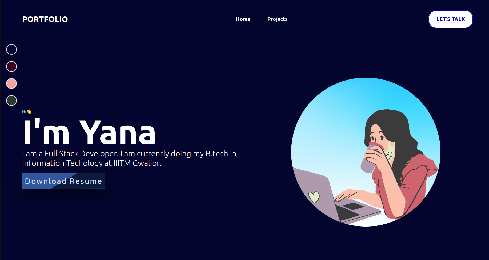

  

- ### 👩‍💻&nbsp; All of my projects are available at [yanagupta.me](https://yanagupta.me)

- ### 🌱 &nbsp;I’m currently learning Cloud Computing

- ### 💬 &nbsp;Ask me about React, Next.js, Node, Express or anything related to Web Development

- ### 👩‍💼&nbsp; I'm open for oppurtunities, get my Resume [here](https://drive.google.com/file/d/19o3cNTYQcTW5u56IvA6CRGGMpBipq7RI/view?usp=sharing)

### 👀 My Github Stats

  

  

### 📫 Reach me out
<a href="https://yanagupta.me" target="blank">Website</a> | 
<a href="https://twitter.com/yana_guptta/" target="blank">Twitter</a> | 
<a href="https://linkedin.com/in/Yana-Gupta" target="blank">Linkedin</a> | 
<a href="https://www.instagram.com/yana.guptaa/" target="blank">Instagram</a> 
